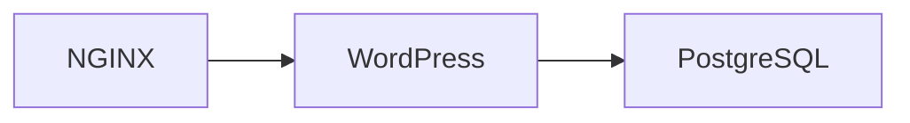
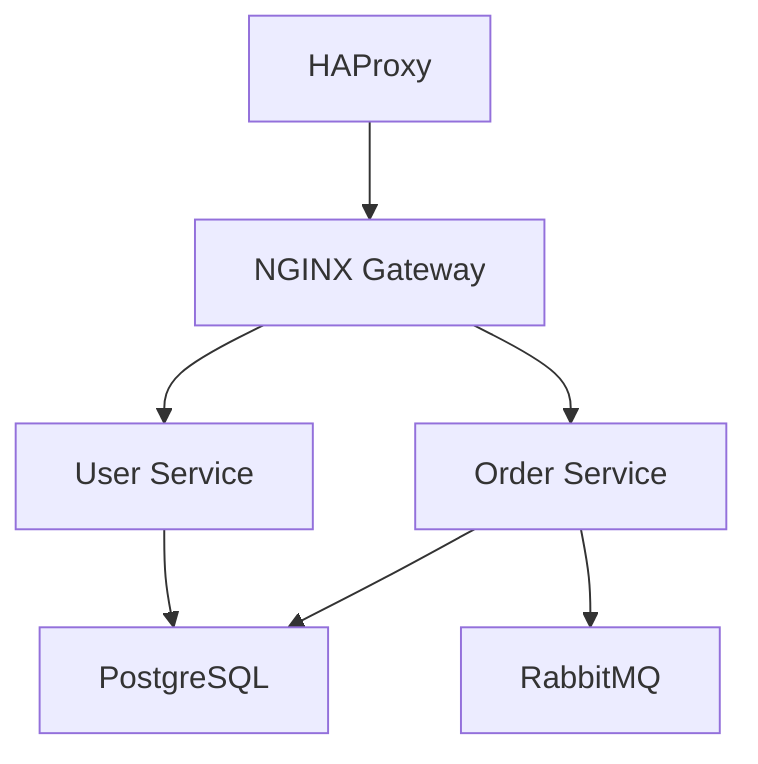

# NQDEV Containers Documentation

Chào mừng bạn đến với tài liệu hướng dẫn sử dụng NQDEV Containers! Đây là bộ sưu tập các Docker containers được tùy chỉnh và tối ưu cho production.

{: .highlight }

> 🚀 **Production-Ready Containers** - Tất cả containers đều được thiết kế và test cho môi trường production với security và performance tối ưu.

## 🌟 Tính năng nổi bật

- ✅ **Vietnamese Timezone** - Tự động cấu hình `Asia/Ho_Chi_Minh`
- ✅ **Security Focused** - Tuân thủ best practices bảo mật
- ✅ **Performance Optimized** - Resource limits và tuning sẵn
- ✅ **Easy Deployment** - Docker Compose ready
- ✅ **Comprehensive Documentation** - Hướng dẫn chi tiết từng service

## 📦 Services Available

<div class="grid-container">










</div>

## 🚀 Quick Start

```bash
# Clone repository
git clone https://github.com/nqdev-group/containers.git
cd containers/nqdev

# Chọn service và khởi chạy
cd nginx/alpine  # hoặc haproxy/alpine, postgres-pgagent, etc.
docker-compose up -d --build --force-recreate --remove-orphans
```

## 📚 Documentation Structure

<div class="grid-container">
  <div class="grid-item">
    <h3><a href="{{ site.baseurl }}/nqdev-containers-guide">🔍 Tổng Quan</a></h3>
    <p>Giới thiệu về tất cả containers, cài đặt nhanh và cấu hình chung.</p>
  </div>
  
  <div class="grid-item">
    <h3><a href="{{ site.baseurl }}/nginx-guide">🌐 NGINX Guide</a></h3>
    <p>Web server với custom modules, rate limiting, GeoIP và SSL/TLS.</p>
  </div>
  
  <div class="grid-item">
    <h3><a href="{{ site.baseurl }}/haproxy-guide">⚖️ HAProxy Guide</a></h3>
    <p>Load balancer với Lua scripting và Redis rate limiting.</p>
  </div>
  
  <div class="grid-item">
    <h3><a href="{{ site.baseurl }}/examples-best-practices">💡 Examples & Best Practices</a></h3>
    <p>Architecture patterns, production deployment và security practices.</p>
  </div>
</div>

## 🛠️ Common Commands

### Health Checks

```bash
# NGINX status
curl http://localhost:18080/nginx_status

# HAProxy stats
open http://localhost:17001

# PostgreSQL connection
psql -h localhost -U superuser -d postgresdb

# RabbitMQ management
open http://localhost:15672
```

### Container Management

```bash
# View logs
docker-compose logs -f [service-name]

# Container stats
docker stats $(docker-compose ps -q)

# Shell access
docker-compose exec [service-name] /bin/bash
```

## 🏗️ Architecture Examples

### Simple Web Application



### Microservices



## 🔒 Security Highlights

{: .warning }

> **Production Security**: Đổi tất cả default passwords trước khi deploy production!

- **SSL/TLS Ready** - Modern cipher suites
- **Rate Limiting** - Built-in protection
- **Network Isolation** - Container-to-container security
- **Resource Limits** - Prevent resource exhaustion
- **Access Control** - IP-based filtering

## 📊 Monitoring Ready

Tất cả containers đều tích hợp monitoring endpoints:

- **NGINX**: `/nginx_status` endpoint
- **HAProxy**: Web-based stats dashboard
- **PostgreSQL**: Health checks và performance views
- **RabbitMQ**: Management UI với metrics

## 🆘 Need Help?

<div class="grid-container">
  <div class="grid-item">
    <h4>📖 Documentation</h4>
    <p>Đọc chi tiết các guide cho từng service</p>
  </div>
  
  <div class="grid-item">
    <h4>🐛 GitHub Issues</h4>
    <p><a href="https://github.com/nqdev-group/containers/issues">Report bugs hoặc feature requests</a></p>
  </div>
  
  <div class="grid-item">
    <h4>💬 Community</h4>
    <p>Join discussions trên GitHub repository</p>
  </div>
</div>

---

## 👥 NQDEV Team

**Maintainer**: NQDEV Platform Engineering  
**Contact**: {{ site.nqdev.support_email }}  
**Website**: [nhquydev.net](https://nhquydev.net)  
**Container Registry**: [GitHub Packages](https://github.com/{{ site.nqdev.github_org }}/containers/packages)

{: .note }

> 💡 **Getting Started**: Bắt đầu với [Hướng Dẫn Tổng Quan]({{ site.baseurl }}/nqdev-containers-guide) để hiểu overview, sau đó chọn service guide phù hợp với nhu cầu của bạn.
